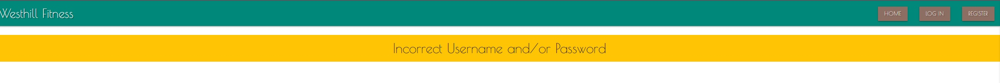

# Westhill Fitness - Two Week Shred Website

## Milestone Project 3 - Backend Development

<h2 align="center"></h2>

* The Westill Fitnes Shred website is designed to accompany a two-week fitness programme used by a local fitness company. The website allows users to access shopping lists, food plans and recipes, as well as contribute recipes for future shreds. It allows the user full CRUD functionality - users can create new recipes, which are stored in a backend database (mongodb), search and retrieve recipes on the website, edit/update their contributed recipes and also delete them if necessary.

* I got the idea for the website from a local fitness company that I have used to participate in a health shred. A health shred is designed to give you meal plans and exercises that should be used over a two week period. It is designed to help users lose weight. The local company which I have based the idea currently use paper plans/paper recipe books which are given to members. I decided this would
be a good basis for a website, allowing users to access their shopping list and meal plans on their mobile phones or computers - making it much easier to follow recipes in their kitchen or access shopping lists in the supermarket.


* This is my Milestone Project 3 submission for Code Institute's Diploma in Web Application Development course. My website uses both relational and non-relational databases, features full CRUD functionality and is built using technologies that I have learnt including HTML, CSS, JavaScript, Python, Flask and PyMongo.

## Live Project

[View the live project here.](https://recipe-ository.herokuapp.com//)

## Repository

[Find the project repository here.](https://github.com/GraeA85/Recipe-ository)

# Table of Contents

## Contents
- [User experience](#user-experience)
  * [User Stories](#user-stories)
    + [First-time Users](#first-time-users)
    + [Returning Users](#returning-users)
    + [Business Owner](#business-owner)
- [Design](#design)
  + [Overview](#overview)
  + [Colour Scheme](#colour-scheme)
  + [Typography](#typography)
  + [Imagery and Aesthetics](#imagery-and-aesthetics)
  + [Icons](#icons)
  + [Cards](#cards)
- [Wireframes](#wireframes)
- [Features](#features)
  + [All Pages Features](#all-pages-features)
  + [Index (Landing Page) Features](#index-landing-page-features)
  + [Register/ Log In Pages Features](#-register-log-in-pages-features)
  + [Find Recipes Page Features](#find-recipes-page-features)
  + [View Recipe Page Features](#view-recipe-page-features)
  + [My Recipes (Dashboard) Page Features](#my-recipes-dashboard-page-features)
  + [Submit/ Edit Recipe Page Features](#submit-edit-recipe-page-features)
  + [Favourite Recipes Page Features](#favourite-recipes-page-features)
  + [Manage Cuisines Page Features](#manage-cuisines-page-features)
  + [Add/ Edit Cuisines Pages Features](#add-edit-cuisines-pages-features)
  + [Delete Recipe/ Cuisines Pages Features](#delete-recipe-cuisines-pages-features)
  + [Error Handling](#error-handling)
- [Future Features](#future-features)
  + [User Experience Features](#user-experience-features)
  + [Development Features](#development-features)
- [Data Model](#data-model)
- [Technologies used](#technologies-used)
  + [Languages Used](#languages-used)
  + [Frameworks Libraries and Programs](#frameworks-libraries-and-programs)
- [Testing](#testing)
- [Deployment](#deployment)
  + [Creating a Gitpod Workspace](#creating-a-gitpod-workspace)
  + [GitHub Pages](#github-pages)
  + [Forking the GitHub Repository](#forking-the-github-repository)
  + [Making a Local Clone](#making-a-local-clone)
  + [Creating an application with Heroku](#creating-an-application-with-heroku)
- [Credits](#credits)
  + [Code](#code)
  + [Media](#media)
  + [Content](#content)
  + [Acknowledgements](#acknowledgements)

# User Experience

## User stoires

### First-time Users

* As a first-time user, I want the landing page of the website to explain the purpose of the website and allow me to preview the content.

* As a first-time user, I want to be able to register for an account.

* As a first-time user, I want the website to work on any device.

### Returning Users

* As a returning user, I want to be able to log in to my account.

* As a returning user, I want to be able to create/ view/ edit/ delete my own recipes.

* As a returning user, I want to be able to view recipes that are used in the two-week shred

* As a returning user, I want to be able to access my shopping lists and meal plans to plan accordingly for the two-week shred

* As a returning user, I want recipes to include useful information such as a title, ingredient list, instructions broken down into steps, time to make, calorie count and an image of the food.

* As a returning user, I want to be able to search for recipes, to make it quicker to find recipes with a certain word in their name, or by cuisine type (breakfast, snack or lunch/dinner)
 
* As a returning user, I want to be able to search for recipes, to make it quicker to find recipes with a certain word in their name or category (breakfast/snack/lunch/dinner).

* As a returning user, I want to be able to access and use the website on any device.

### Buisness Owner

* As a business owner, I want users to be able to create, edit and delete their own recipes, but not those of any other user.

* As a business owner, I want the adding, editing and deleting of recipe categories to be limited to admin or those with permission. 

* As a business owner, I want it to be as easy as possible for users to submit recipes, e.g. they can copy and paste an ingredients list in, but it will display in a formatted and easy to read list on the recipe page.

* As a business owner, I want the website to function and look good on any device.

## Design

### Overview

- The website design is simple, colourful and youthful. I looked at the design of cookbooks and similar recipe websites for inspiration. The Shred website's aesthetic is simple yet full of character, inviting and easy to use.

### Colour
<h2 align="center"></h2>
<br>

- The Shred website uses a simple colour scheme of black, white, light grey and dark grey with turquoises, yellow and browns. The background is white, with a Westhill Signature turqouise chosen for the navbar and a two-tone grey footer. I have used cards with a white background for areas of dense text for improved legibility. The website brand, social media icons and anchor links are in the website’s footer in antique white. Buttons are either in brown or greens and reds.

### Typography

- Headings and recipes are in 'Poiret One' with cursive as a fallback font. Other texts are presented with the 'Edu NSW ACT Foundation' font as it stands out on all devices and gives that "notebook" feel as the website is updated frequently to account for new shreds every season of the year.

### Imagery 

- I have not used much imagery on the website, as users can post an image URL for the recipes they upload. There is a splash image on the landing page to set the tone of the website (healthy foods only!) - I have set the image as transparent for appropriate styling of the website.

### Icons

- Font awesome icons are used throughout the website, mainly sticking with the food/fitness theme. 

### Cards

- I have used Materialize CSS card components for displaying recipes and forms. This makes the content stand out from the website background. It also neatly presents the various recipes, which can be easily accessed on a desktop PC or mobile phone.

# Wireframes

- [View my homepage wireframe in PDF form here](./static/images/westhill-home.pdf)
- [View my recipe page wireframe in PDF form here](./static/images/westhill-recipe.pdf)


# Features

## All Pages Features

### Nav Bar

<h2 align="center"></h2>
<h2 align="center"></h2>
<h2 align="center"></h2>
<h2 align="left"></h2>
<h2 align="left"></h2>

- The nav bar presents different options whether the user is logged in or logged out or an administrator.

- The links change colour on hover, to signal to the user which link they have the mouse over.

- The logo links back to the main landing page.

- The nav bar turns into a slide-out menu on smaller screen sizes

### Footer 

<h2 align="center"></h2>

- The footer includes the website’s name and location. 

- It also features icons with external links to social media. These windows open in a new tab. The icons feature ARIA labels for accessibility best practices.

### Flash Messages

<h2 align="center"></h2>

- Flash messages appear to confirm when a user has completed an action, namely logging in, logging out, editing a recipe and deleting a recipe.

- The styling of the flash messages is inkeeping with the rest of the site and colour scheme. They alert the user when required but not enough to cause alert fatigue.

## Index (Landing Page) Features

<h2 align="center"></h2>

- The purpose of the Westhill Fitness Shred Homepage is to explain the purpose of the website. It does this with an eye-catching jumbatron, short explanation and a 'three-across' explainer section with icons, allowing the user to access their shopping lists, recipes and meal plans. These cards are only accessible once the user is registered and logged in, if not logged in the user is drawn to the GET STARTED button as part of the jumbotron. 

- Once a users are logged in, the navbar buttons on the landing page change. This means that the page is still useful for a returning user, as it directs them to different pages within the website.

## Register/ Log In Pages Features

<h2 align="center"></h2>

<h2 align="center"></h2>

- The Register and Log in pages both feature forms, a large submit button, and a link to the login page in case a user misclicks.

- The Register form features input fields for Username and Password. All fields are required.

- The Log in form features input fields for Username and Password. All fields are required.

- The User's password is hashed for security.

<h2 align="center"></h2>

- Each Username must be unique, If it already exists, a flash message informs the user to try another username.

<h2 align="center"></h2>

- If incorrect log in details are provided, then a flash message informs the user that the Username and/or password is incorrect.

<br>


## Recipes Page Features

<h2 align="center"></h2>

- The purpose of this page is to show the users all recipes. This includes their own recipes and those recipes added as part of the shred mealplan.

- From this page, users can search recipes, quick-view recipes, edit and delete recipes (only recipes that the user has added).

- The user's own recipes appear in the same way as those added as part of the meal plan. I chose to do this to keep the format neat. The delete and edit buttons are only viewable for the user that added them, and admin.

### Search Recipes

- The search feature uses a MongoDB's index. This returns search results based on the recipe name and recipe category.

<h2 align="center"></h2>

- If no results are found, then a message appears to inform the user.
<br><br>
## Quick View Recipes

<h2 align="center"></h2>
<h2 align="center"></h2>

- The quick-view expands the information on the card, that the user can scroll through without navigating away from the page. 

- The quick-view is accessed by pressing the button with an  eye icon. There is a tooltip that appears when the button is hovered over and an Aria Label for screenreaders.

- I included this feature to help keep the recipe cards neat and consistent. The intital information that the user can see is the recipe image (if provided) and title.

- To see the full details of the recipe (ingredients and instructions list) the user simply clicks the eye icon, and the cross button to return to the recipe card.


## Add Recipe feature

- The website allows users to add their own recipes as well as edit and delete. The main reason for this is to encourage users to look for healthy recipes - if they submit them to the website they may be used in the next seasons shred, which rewards those whos recipes get chosen.

<h2 align="center"></h2>

- The add recipe feature takes the user to a form to input the recipe. They must select a category (breakfast/snack/lunch/dinner), recipe name (minimum 5 characters), ingredients list (user is prompted to add each ingredient to a new line), instructions (new line for each instruction), prep and cooking time, calories per serving and how many people served. There is an option to add a URL of an image - this is designed to be held externally (i.e. free images/images with permission). The url must end in the appropriate image format to display correctly.

<h2 align="center"></h2>

- Once a recipe is successfully created, the user is taken back to the recipe page and a flash message shown to confirm addition of recipe.

## Edit Recipe Page Features

<h2 align="center"></h2>

- If a user wishes to edit their recipe they will be taken back to the add recipe page with the form fields pre-populated with their previous entry. This is displayed in a list for easy editing. Once the editing is finished the user clicks the button to confirm. If no changes are required the user can click cancel editing to return to the recipe page.

<h2 align="center"></h2>

- The submit and edit recipe pages both feature forms and red submit buttons. The edit page also features a cancel button which directs the user back to to their My Recipes page.

- Input fields include
  - Recipe name (required - text - max 50 characters)
  - Cuisine (selected from dropdown - required)
  - Ingrediant list (required - text - comma seperated)
  - Instructions (required - text - new line seperated)
  - Difficulty (selected from dropdown - required)
  - Duration in minutes (number - required)
  - Serves (number - required)
  - Image URL (text)
  - Tags (required - text - max 50 character - comma seperated)
  - URL (text)

- All inputs are validated and feature labels

- When a user goes to edit a recipe, the content appears in the relevant input fields.

- If a recipe image URL is not provided, then a defualt colour swatch is used.

### Recipe form considerations

- It was difficult to get the right balance between making it easy for users to submit recipes, and making sure the recipes were well presented on the website.

- I decided that I wanted to store the Ingrediants List, Instructions and Tags as arrays in Mongo DB.

- I decided the best way to do this was to make the user enter the Ingrediants List and Tags as comma seperated lists, and the Instructions and a new line seperated list.

- This is because, while developing the site, I found it most convieant to copy and paste recipes in from other websites. That's why I decided to create single text-area inputs for the ingrediants list and instructions list, as opposed to making the user enter each item individually. 

- This solution is not ideal, as it leaves a lot of trust in the user to correctly input recipes, so that they are clear and legible to other users. I have increased speed and ease, at the cost of making the system fool-proof.

- As the ingrediants list input is a text area, I have removed the ability to enter a new line, to encourage the user to use commas.

- However, the user can still copy and paste text in as seperate lines into the ingrediants field instead of using commas. This feature was useful for development, however I have not made this apparent to the user so to the keep the form clear and simple. So I would consider removing this feature in a real-world application.

## Favourite Recipes Page Features

<h2 align="center"></h2>

- This feature allows the user to add recipes to their My Favourites page. This would be useful if their is another user's recipe that they like, and would like to "bookmark" it so they can find it easily, and save them having to look through the Find Recipes page.

- Users can also favourite their own recipe if they choose.

- User's can favourite recipes simply by clicking the 'Favourite Recipe' button. Once a recipe is favourited, this is replaced by an 'Unfavourite recipe' button. Clicking this will remove the recipe from the User's favourites.

<h2 align="center"></h2>

- If the user has no favourite recipes, then a message appears to inform the user.

## Manage Cuisines Page Features

<h2 align="center"></h2>

- This page lists all the available cuisines in alphabetical order. It gives the admin user the option to add, edit or delete cuisines.

<h2 align="center"></h2>

- This page is only visible to admin users. If a non-admin is logged in and tries to access this page or tries to access the submit, edit or delete a cuisine pages, they will see a flash message informing them and be redirected to the find recipes page.

## Add/ Edit Cuisines Pages Features

<h2 align="center"></h2>

<h2 align="center"></h2>

- The add and edit cuisine pages feature a form with a single input field for Cuisine Name and a red submit button. The edit button also features a cancel button.

<h2 align="center"></h2>

- Each cuisine name must be unique, and is checked before commiting to the database. If the user enters an exsisting cuisine name, a flash message appears informing them.

- Like the Manage Cuisines page, a flash message appears if a non-admin user tries to access this page.

## Delete Recipe/ Cuisines Pages Features

<h2 align="center"></h2>

<h2 align="center"></h2>

- If a user clicks on a 'Delete Recipe' or 'Delete Cuisine', they will be taken to this page to confirm the deletion. This is extra step to stop users accidentally deleting things.

- Cuisines are set up with a cascade delete effect. So any recipes with that cuisine will also be deleted. This is made clear on the delete cuisine page.

- There is a cancel button on each page.

## Error Handling

- In most instances if there is an error, e.g. the recipe id in the page URL is changed, then the user will be redirected back to the Find Recipes page. Logged-out-users will be directed to the log in page, as they cannot access the Find Recipes page.

- There is an unresolved bug if the page URL is changed on the edit or delete Cuisine page, then the Execption clause will not trigger. See the unresolved bug section.

- If the user's session cookie deleted, then they will be logged out and unable to access logged-in features.

# Future Features

## User Experience Features 

### Filter by cuisine

- The search functionality does not search by cuisine name as these are not stored in Mongo DB. I would also like to add a filter to the Find Recipes page that filters by cuisine name.

### Tags are clickable and act as a filter

- The tags are used within the search function so they are searchable. However they could be used in further ways, such as being clickable and showing other recipes with the same tag.

### More “Featured Collections”

- I feel the index page would be improved by having more featured collections such as Most Favourited or Fewest Ingrediants.

### Confirm delete modal rather than a page

- I feel a modal would be better here. I made a page for ease.

### Further improvements to submit/ edit recipe forms

- As explained in the Features section, I feel there is more I could do to improve the UX of inputting a recipe. For example, there could be a format button which would correctly format the user's input. Or a live preview so that the user can see how their input will look on the site.

### Add a print recipe button to the View Recipe page

- I could add a print recipe button, which would open the page as a printable format in the printer dialog box.

### Make a confirm password input 

- This would help the user ensure they haven't made a typo in their desired password.

### Add edit/ delete user account functionality including reset password

- This would allow the user to edit their username or password, or delete their account.

### Contact admin button

- I could add a contact admin button, to notify admin if there is an error out of hours.

### Add Private and Public comments

- Users could add private comments (e.g. their own notes from having tried making the recipe) and/or public comments to let other users know helpful tips or reviews.

## Development Features

### Make recipe card snippet to reduce code repition

- As I have used the same Recipe Card format within multiple templates, I could refactor this code and use a "snippet" to reduce the number of times this code is repeated.

### More detailed Try Except exception clauses

- I would like to add more detailed exception clauses to my Try Except statements. I have used a catch-all clause for simplicty.

### More Automated Testing

- I would like to add more automated tests for my Python and Javascript files. This would mean that developers who work on the website in the future can add new features and be sure they are not breaking the code.

# Data Model

- [View my Database structure in PDF form here](gather/static/readme/databases/gather-database-schema.pdf).

# Technologies Used

## Languages Used

- [HTML5](https://en.wikipedia.org/wiki/HTML5)

- [CSS3](https://en.wikipedia.org/wiki/CSS)

- [JavaScript](https://en.wikipedia.org/wiki/JavaScript)

- [Python](https://en.wikipedia.org/wiki/Python_(programming_language))

## Frameworks Libraries and Programs

- [Heroku](https://id.heroku.com/login)
  - Heroku is the deployment source I used for this project. I'm also using it for the Postgres relational database

- [MongoDB](https://www.mongodb.com/)
    - I'm using MongoDB for my non-relational database.

- [Flask](https://flask.palletsprojects.com/en/2.2.x/templating/)
  - Templating language I've used with Python to add logic to my html templates.

- [Jinja](https://jinja.palletsprojects.com/en/3.0.x/)
  - Templating language I've used with Python to add logic to my html templates.

- [Materialize CSS](https://materializecss.com/)
  - Front-end library with HTML, CSS and Javascript based componants. I used features including Nav bar, Cards, Buttons and Forms.

- [jQuery](https://jquery.com/)
  - I used jQuery to add functionality to MaterialiseCSS componants.

- [Google Fonts](https://fonts.google.com/)
  - Two fonts are imported from google fonts.
  
- [Font awesome](https://fontawesome.com/)
  - I used icons from font awesome on buttons.

- [Git](https://git-scm.com/)
  - Git was used as a version control in the terminal.

- [Github](https://github.com/)
  - Github was used to create and store the project repository.

- [Gitpod](https://gitpod.io/)
  - Gitpod was used to create my files and where I wrote the code.

- [Balsamiq](https://balsamiq.com/)
  - Balsamiq was used to create Wireframes for the project during the initial planning stage.

- [Techsini](https://techsini.com/multi-mockup/)
  - Techsini was used to help check responsiveness and take screenshots of the page at different screen sizes.

- [Adobe Photoshop](https://www.adobe.com/ie/products/photoshop.html)
  - Photoshop was used to resize images for the website.

- [TinyPNG](https://tinypng.com/)
  - TinyPNG was used to compress images for a faster loading time.

- [WebFormatter](https://webformatter.com/html)
  - WebFormatter was used to help beautify the code.

- [Google Chrome Dev Tools](https://developer.chrome.com/docs/devtools/)
  - Google Chrome's Dev Tools were used while building the project to test responsiveness and for debugging.

- [dbdiagram](https://dbdiagram.io/)
  - Tool used to mock up database structure diagram.

- [Unsplash](https://unsplash.com/)
  - Unsplash was used to source the jumbatron imager.

# Testing

- Please refer [here](TESTING.md) for more information on testing of the Gather website

# Deployment

## Creating a Gitpod Workspace

The project was created in Gitpod using the Code Institute Gitpod Full Template using these steps:

1. Log in to GitHub and go to the [Code Institute student template for Gitpod](https://github.com/Code-Institute-Org/gitpod-full-template)
2. Click 'Use this Template' next to the Green Gitpod button.
3. Add a repository name and click 'Create reposiory from template'.
4. This will create a copy of the template in your own repository. Now you can click the green 'Gitpod' button to open a workspace in Gitpod.

## Forking the GitHub Repository

Forks are used to propose changes to someone else's project or to use someone else's project as a starting point for your own idea. By forking the GitHub Repository you make a copy of the original repository on our GitHub account to view and/or make changes without affecting the original repository.

To Fork a Github Repository:

1. Log in to GitHub and go to the [GitHub Repository](https://github.com/Isabella-Mitchell/gather-recipe-website)
2. Locate the Fork button in the top-right corner of the page, click Fork.
3. You should now have a copy of the original repository in your GitHub account.

## Making a Local Clone

You will now have a fork of the repository, but you don't have the files in that repository locally on your computer.

To make a local clone:

1. Log in to GitHub and go to the [GitHub Repository](https://github.com/Isabella-Mitchell/gather-recipe-website)
2. Above the list of files, click  Code.
3. To clone the repository using HTTPS, under "Clone with HTTPS", click the 'Copy' icon. To clone the repository using an SSH key, including a certificate issued by your organization's SSH certificate authority, click Use SSH, then click the 'Copy' icon. To clone a repository using GitHub CLI, click Use GitHub CLI, then click the 'Copy' icon.
4. Open Git Bash.
5. Change the current working directory to the location where you want the cloned directory.
6. Type git clone, and then paste the URL you copied earlier. It will look like this, with your GitHub AE username instead of YOUR-USERNAME:

```
$ git clone https://github.com/YOUR-USERNAME/YOUR-REPOSITORY
```

7. Press Enter. Your local clone will be created.

```
$ git clone https://github.com/YOUR-USERNAME/YOUR-REPOSITORY
> Cloning into `gather-recipe-website`...
> remote: Counting objects: 10, done.
> remote: Compressing objects: 100% (8/8), done.
> remove: Total 10 (delta 1), reused 10 (delta 1)
> Unpacking objects: 100% (10/10), done.
```

Click [Here](https://docs.github.com/en/github-ae@latest/get-started/quickstart/fork-a-repo) for the GitHub quick start guide with images and more detailed explanations of the above process.

## Creating an application with Heroku

You will need to deploy the application using Heroku.

1. Create a requirements.txt file by typing ``` pip3 freeze --local > requirements.txt ``` into the Gitpod CLI. Ensure this is added to your .gitignore file.
2. Create a Procfile by typing ```echo web: python app.py > Procfile```. Open it and ensure it doesn't have a new line, as this can create errors. Ensure it starts with a capital P.
3. Add and commit these files to Github.
4. Go to [Heroku](https://dashboard.heroku.com/apps). Log in or create an account
5. Click the 'New' button and click 'Create new app'.
6. Enter a unique name for your project with no capital letters or spaces and select your region. Click 'Create App'.
7. Inside your project, go to the Resources tab and create a Heroku Postgres Database
8. Inside your project, go to the 'Settings' tab. Scroll down and click 'Reveal Config Vars'.
9. Add in the following variables
  - IP : 0.0.0.0
  - PORT : 5000
  - MONGO_DBNAME : Your MongoDB database name
  - MONGO_URI : This can be found on MongoDB by going to Clusters, Connect, Connect to your application
  - SECRET_KEY : Your secret key
10. Deploy your project by going to the Deploy tab and choose 'Connect to Github'
11. Find your repository name and select Connect.
12. To connect your Heroku database, go to 'More' in the top right and select run console. Enter ```python3``` to access the python intepreter.
13. Then type ```From gather import db```. Then type ```db.create_all()```. You can then exit the console.

# Credits

## Code

- Materalize CSS: I used this library throughout the project. Particularly for the nav bar, cards, forms and buttons.

- Code Institute: I referred to lessons and source code from Code Institute's Web Application Development course. I sourced the User Authentification and Search bar functionality from the Task Manager Walk Through Project.

- Stack Overflow: I referred to Stack Overflow articles throughout the project. I used a line of code from this [Bug fix to stop testing export showing as error in browser article](https://stackoverflow.com/questions/66349868/jest-unit-testing-module-export-error-in-browser-console), [creating a UL from a JS array](https://stackoverflow.com/questions/11128700/create-a-ul-and-fill-it-based-on-a-passed-array) and [how to disable the enter key being used in a textarea](https://stackoverflow.com/questions/6714202/how-can-i-disable-the-enter-key-on-my-textarea).

- W3Schools: I referred to guides on [Python MongoDB](https://www.w3schools.com/python/python_mongodb_getstarted.asp) amongst others.

- Geekflare: I referred to this walkthrough on [Python Unit Testing](https://geekflare.com/unit-testing-with-python-unittest/).

- Documentation. I referred to this documentation provided by [Python](https://docs.python.org/3/library/exceptions.html), [Jest](https://jestjs.io/docs/getting-started), [MongoDB](https://www.mongodb.com/docs/manual/reference/method/ObjectId.valueOf/) amongst others.

## Content

- [BBC Good Food](https://www.bbcgoodfood.com/): I used this exisiting recipe platform to help me plan the user experience and features of the website. I also sourced many recipes from this website.

## Media


## Acknowledgements


Please note this is a personal project. This website is purely for the sake of the developer's portfolio and not for public consumption.

